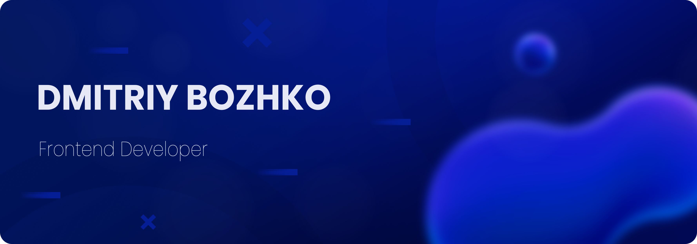

#
I am a Full-Stack Web Developer who specializes in creating high-quality web applications running on the client and server sides. My experience includes the development of both frontend and backend applications, which allows me to create full-fledged web services. I am attracted by the opportunity to constantly improve my skills and I am always ready to learn new things. My goal is to create web applications that are not only functional, but also aesthetically appealing.

#
🔷 Main stack: NextJS, NestJS

🔷 Familiar with VueJS, Laravel, and Wordpress

🔷 I always prefer to use TypeScript and SCSS in my projects

🔷 I like to write clean and easy-to-read code. This is my passion and one of the most important aspects of my approach

🔷 I also enjoy creating a beautiful and functional design, although this is not my main specialization.

🔷 I also have a profile on [CodePen](https://codepen.io/finikkkk) where I share my frontend experiments

#

